    

 

    
    
    
    
    

---
## `whoami`

<table>
<tr>
<td width="70%">

I am a **Full-Stack Developer** and **CS Student** based in **Burkina Faso**. I enjoy tackling complex challenges and building scalable applications. My approach to technology is driven by continuous learning and solving real-world problems through daily practice.

</td>
<td width="30%">
  
## `Certified`

  

</td>
</tr>
</table>

---
## `stats`

<!-- Stats Cards - Grid System -->

  
  

---
## `highlighted`

<table>
<tr>
<td width="50%" valign="top">

### [MaskMe](https://github.com/k13lucien/maskme)

*A lightweight, modular Python library for anonymizing structured, semi-structured, and unstructured data while preserving its statistical utility. Built for GDPR, HIPAA, and modern privacy compliance.*

  

</td>
<td width="50%" valign="top">

### [Tigmi](https://github.com/k13lucien/Tigmi)

*Curated list of awesome open-source projects from Burkina Faso. Building visibility for African OSS.*

  

</td>
</tr>
</table>

 

*`"Code with purpose, shape the future." @noid K. Lucien`*

